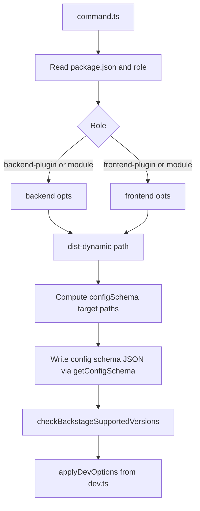

# Shared `plugin export` command flow

This document describes steps in [`command.ts`](../../src/commands/export-dynamic-plugin/command.ts) that run **after** the backend or frontend exporter returns the `dist-dynamic` path.

← [Back to index](./README.md)

## High-level diagram

## Role dispatch

1. Load the target **`package.json`** and resolve **`backstage.role`** via `@backstage/cli-node` `PackageRoles`.
2. If role is **`backend-plugin`** or **`backend-plugin-module`**, call **`backend(opts)`** and set config schema paths to:
   - `dist-dynamic/dist/configSchema.json`
   - `dist-dynamic/dist/.config-schema.json`
3. If role is **`frontend-plugin`** or **`frontend-plugin-module`**, call **`frontend(opts)`**. Config schema paths are built dynamically:
   - If `dist-dynamic/dist-scalprum` exists → add `dist-scalprum/configSchema.json`
   - If `dist-dynamic/dist` exists → add `dist/.config-schema.json`
4. Any other role → **error** (not supported for this command).

## Config schema emission

- **`getConfigSchema(rawPkg.name)`** ([`lib/schema/collect`](../../src/lib/schema/collect.ts)) produces the schema payload.
- For **each** computed path, the command writes **`paths.resolveTarget(configSchemaPath)`** (JSON, 2-space indent) so files land under the CLI target package (typically next to the generated **`dist`** / **`dist-scalprum`** trees).

## `backstage.supported-versions` (`checkBackstageSupportedVersions`)

Runs only when **`backstage.json`** exists at the **monorepo root** (`paths.targetRoot`).

- Reads **`version`** from `backstage.json`.
- If the derived **`dist-dynamic/package.json`** already has **`backstage.supported-versions`**:
  - If it is a **single semver** and the range is **incompatible** with `~backstageVersion` → **throws**.
  - If it is a **range** and incompatible → **warning** and the field is **overwritten** with `backstageVersion`.
- If **`supported-versions` is missing** → it is **set** to `backstageVersion` from `backstage.json`.

## `--dev` (`applyDevOptions`)

Implemented in [`dev.ts`](../../src/commands/export-dynamic-plugin/dev.ts). No-op unless **`--dev`** is set.

1. **Node platform** (`backend-plugin`, `backend-plugin-module`): create a **directory symlink** from the plugin’s **`src`** to **`dist-dynamic/src`** so source maps resolve during local runs.
2. **Dynamic plugins root**:
   - If **`--dynamic-plugins-root`** is passed → that directory is used; the exporter **copies** `dist-dynamic` into  
     `<root>/<pkg-with-slashes-as-dashes>-dynamic` (backend) or without the `-dynamic` suffix for **frontend** roles.
   - If **`--dynamic-plugins-root`** is **omitted** → load app config from **`paths.targetRoot`**, read **`dynamicPlugins.rootDirectory`**, resolve to an absolute path, then **symlink** `dist-dynamic` to the same destination naming rule. Missing `dynamicPlugins.rootDirectory` → **error**.

When copying (explicit root), the root folder is created if needed and a **`.gitignore`** with `*` may be added there.

← [Back to index](./README.md)
